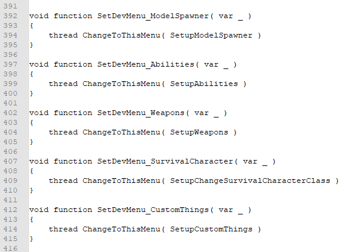

# 自訂義開發者選單\(Dev Menu\) \(不安全\)


我們不推間用Dev模式開服，因為她會帶來不必要的安全性問題，想新增選單請移步如何增加新的選單\(未完工\)。


1.打開 `\platform\scripts\vscripts\ai\sh_dev_npc_settings.gnut`並在上面添加一個global function: `global function Setup<something>` \(如: global function SetupCustomThings\)


  
2: 然後到底下添加一個void function `void function Setup<something>()` \(如: void function SetupCustomThings\(\)\)

3: 在void function底下輸入:

```text
{
    #if UI

    SetupDevCommand( "<Name you want to have displayed>", "give <name on the .txt file>" )

    #endif
}
```

4: 到 `\platform\scripts\vscripts\ui\menu_dev.nut` 然後在271行位置即可輸入你的選單\(放在程式中的順序即為dev menu中的位置\)

5: 找到你想要的位置後輸入: `SetupDevMenu( "<dev menu的名稱>", SetDevMenu_<你在global和void function中"Setup"後的內容> )` \(Example: SetupDevMenu\( "Custom Community Things", SetDevMenu\_CustomThings \)\)


6: 往下移到392行新增一個void function:

```text
void function SetDevMenu_<你在global和void function中"Setup"後的內容>( var _ )
{
    thread ChangeToThisMenu( Setup<你在global和void function中"Setup"後的內容> )
}
```



